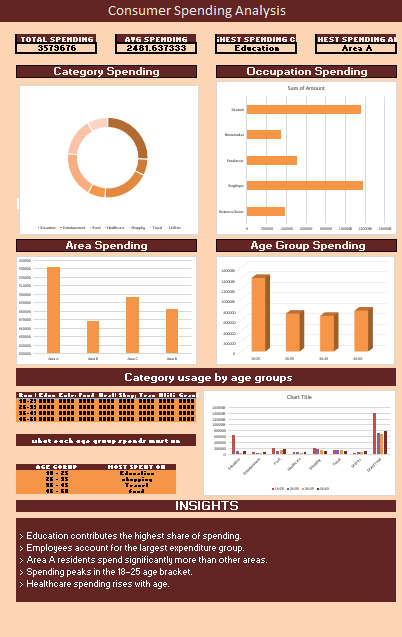

# Consumer Spending Analysis Dashboard (Excel)

## Overview

This project analyzes the spending behavior of 500 consumers using Microsoft Excel.

A synthetic dataset was created to simulate consumer spending across different age groups, occupations, areas, and spending categories.

The dashboard provides interactive insights into spending patterns and demonstrates Excel-based data analysis techniques.

---

## Dataset

Number of Records: 500

Columns:

- Person ID
- Age
- Age Group
- Gender
- Occupation
- Area
- Category
- Amount

---

## Objectives

- Identify the highest spending category
- Compare spending across occupations
- Analyze spending by age group
- Compare spending across different areas
- Summarize consumer spending trends

---

## Tools Used

- Microsoft Excel
- Pivot Tables
- Pivot Charts
- Conditional Formatting
- Dashboard Design

---

## Dashboard Preview

---

## Key Insights

- Education contributed the highest share of spending.
- Employees recorded the highest overall expenditure.
- Area A showed the highest consumer spending.
- Spending peaked among the 18–25 age group.
- Healthcare spending increased with age.

---

## Future Improvements

- Add interactive slicers
- Improve KPI cards
- Recreate the dashboard in Power BI
- Perform SQL-based analysis on the same dataset
